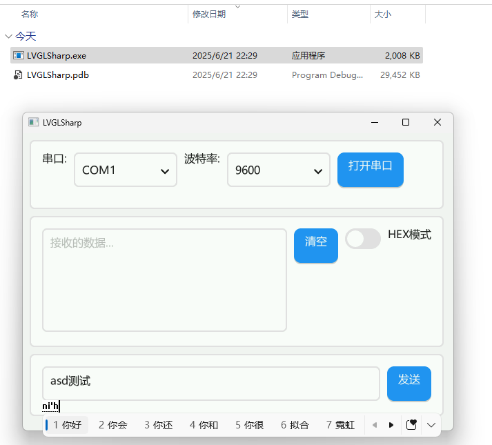
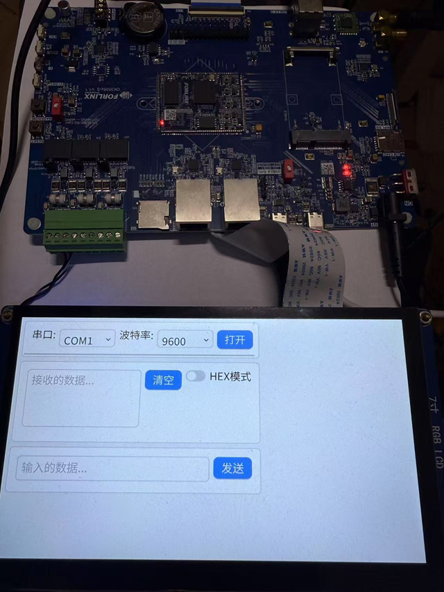

# LVGL C# Binding Library

[中文](./README.md) | English

# Thanks to ClangSharpPInvokeGenerator, all API interoperability of LVGL is now supported.

## The following is a preview of an win-x64, linux-arm application that has undergone AOT (without dependencies)

## Reference

https://github.com/lvgl/lvgl
